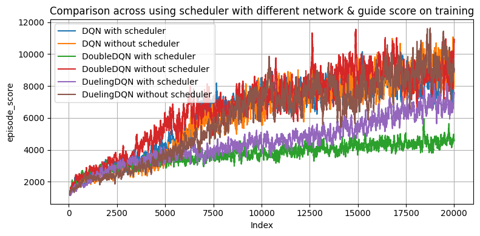
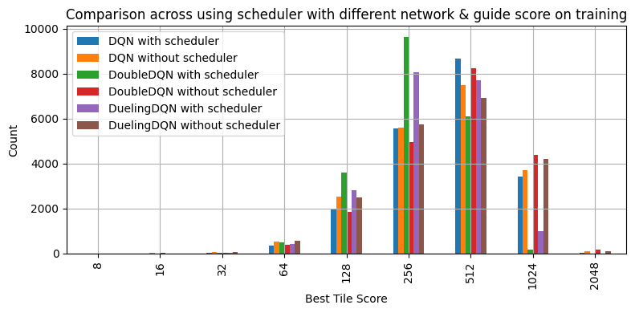
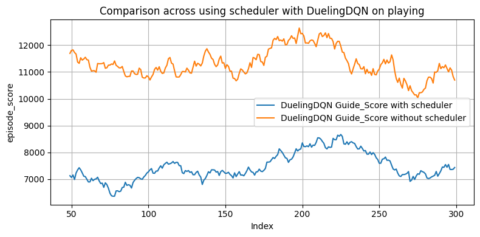
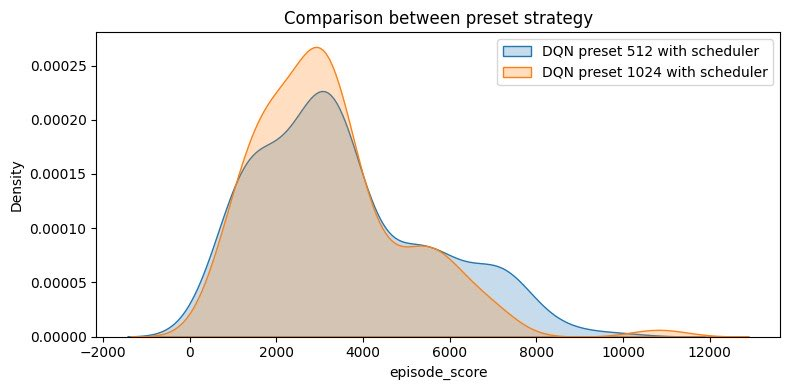
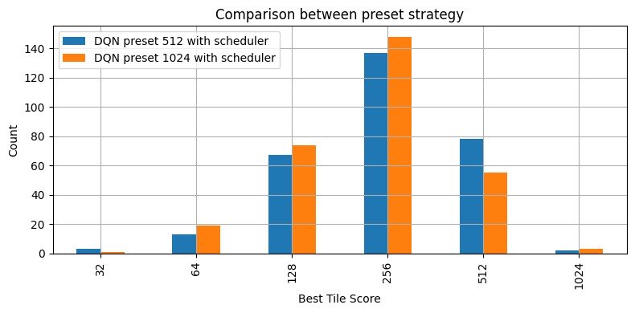
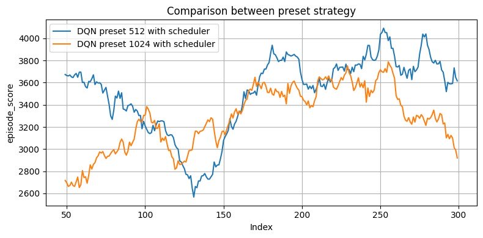

# Comparative DQN Approaches for 2048 Puzzle Game
FRA 503: Deep Reinforcement Learning for Robotics

## Member
1. Kullakant Kaewkallaya 64340500006
2. Peerawat Santifuengkul 64340500043
3. Monsicha Sopitlaptana 64340500071


## Introduction

2048 is a sliding tile puzzle game. The objective of the game is to slide numbered tiles on a grid to combine them and create a tile with the number 2048. This game is played on a plain 4×4 grid, with numbered tiles that slide when a player moves them using the four arrow keys. 

In this project, we will implement Deep Reinforcement Learning to play the 2048 game using different algorithms: Deep Q-Network, Double Deep Q-Network, and Dueling Deep Q-Network to compare the performance of each algorithm, including differences in reward functions and experimental setups.

## Challenges

A key challenge in training a 2048-playing model is that the states it encounters depend on its current performance. An untrained or weak model often fails early, rarely reaching higher-value tiles like 512 or 1024. As a result, it mostly sees early-game states and struggles to learn strategies for the late game. This slows down training, as the model needs more time and experience to handle advanced scenarios it rarely encounters.

## Technique

### Literature review

#### [**1. Playing 2048 with Deep Q-Learning (With Pytorch implementation)**](https://medium.com/@qwert12500/playing-2048-with-deep-q-learning-with-pytorch-implementation-4313291efe61)
This blog provides information about the 2048 game and how to apply reinforcement learning to play it effectively. The post compares a baseline random action play against a Deep Q-learning approach, which estimates Q-values from current states encoded as one-hot tensors of each tile value level.

The blog also provides an example of a network used in Deep Q-learning that incorporates ConvBlocks to extract features from the encoded states using different kernel sizes. These features are then forwarded to linear layers to produce Q-values for each possible action as the network output.

The experiment evaluates performance based on score distribution and maximum tile achieved in each episode. Results show that the Deep Q-learning approach significantly outperforms the random action approach.

#### [**2. Developing Value Networks for Game 2048 with Reinforcement Learning**](https://www.jstage.jst.go.jp/article/ipsjjip/29/0/29_336/_pdf/-char/ja)
The paper describes an experiment examining various training configurations for the 2048 game task. It presents information about network architecture, state representation (consistent with previous literature), batch size, and additional techniques to improve the training process.

The experiment is divided into several sections, including batch training, exploiting board symmetry, network architecture, network hidden dimension size, and additional strategies such as jump-starting boards with high-value tiles. Results indicate that batch size slightly affects learning performance, with larger batch sizes improving the learning process, while online TD learning shows a significant drop in performance. The network architecture called 'CNN22', described in the paper, provided the best performance. Additionally, the strategy of jump-starting initial states using the restart approach improved learning performance. The paper also documents extended training of approximately 240 hours using the optimal configuration and high-performance hardware.

#### [**3. Reinforcement learning in 2048 game**](https://cogsci.fmph.uniba.sk/~farkas/theses/adrian.goga.bak18.pdf)
This paper studies the components used in a reinforcement learning system designed to play the 2048 game. It provides information about the basic components of the reinforcement learning environment, neural network definitions, and training techniques. The paper also describes the DQN (Deep-Q Network) family, including vanilla DQN, Double DQN, and Dueling DQN, which can be used in the Deep-Q learning process.

The study defines different reward functions, all based on the number of merged tiles in each environment step, which aim to keep reward values between (-1,1). Two approaches for state encoding are presented: the first converts tile values to powers of 2 (between 1-11) and divides by 11 to normalize values to [0,1]; the second applies the grey code concept for state encoding.

Results show that the experiment using the first type of state encoding, combined with a reward function that divides the number of merged tiles by a defined value, can win the game (achieve a 2048 tile) in 7.8% of 10,000 training episodes, while other approaches failed to reach the 2048 tile.

### Game Environment 

#### State
The game is played on a 4×4 grid filled with numbered tiles in the form of 2^x. Therefore, the number of possible states can be modeled as 16^16, since there are 16 grid spaces and each can be filled with a value starting from 0, 2^1, 2^2, ..., up to 2^15. The actual number of states may be even larger depending on how the state space is defined, such as treating empty tiles differently or allowing values beyond 2^15.

To encode the state of the board before feeding it into the neural network, we first flatten the board and replace each non-zero value with its base-2 logarithm, while keeping zeros as 0. Next, we apply one-hot encoding with 16 classes, then flatten the resulting tensor. Finally, we reshape the board to (1, 4, 4, 16) and permute the dimensions to (1, 16, 4, 4) to match the expected input format for the neural network.

#### Action

The player has four possible actions to move the tiles: left, up, right, or down. These actions can be categorized into two types: valid moves, which can be executed in the current state of the board, and non valid moves, which cannot be executed given the current board configuration.

#### Termination

The game terminates when there are no empty spots left on the board and no further merges are possible.

### Algorithms

#### **1. Vanilla DQN**

Deep Q-Network (DQN) is a value-based reinforcement learning algorithm that combines Q-Learning with deep neural networks to enable agents to learn control policies directly from high-dimensional state spaces

- **DQN Network**


- **TD Loss Function**

```math
\text{LossFunction} = Q_{\text{best}}(s_t, a_t) - Q(s_t, a_t)
```

- **Estimated TD Target**
  
```math
Q_{\text{best}}(s_t, a_t) = R_{t+1} + \gamma \max_{a} Q(s_{t+1}, a)
```

- **Q-value Update Rule**
  
```math
Q(s_t, a_t) \leftarrow Q(s_t, a_t) + \alpha \left( R_{t+1} + \gamma \max_{a} Q(s_{t+1}, a) - Q(s_t, a_t) \right)
```

  - `s_t` : Current state at time step *t*  
  - `a_t` : Action taken at state `s_t`  
  - `R_{t+1}` : Reward received after taking action `a_t` from state `s_t`  
  - `s_{t+1}` : Next state after taking action `a_t`  
  - `Q(s, a)` : Estimated action-value function for state `s` and action `a`  
  - `Q_{\text{best}}(s_t, a_t)` : Target Q-value for updating at time *t*  
  - `\gamma` : Discount factor (0 ≤ γ ≤ 1), balancing immediate and future rewards  
  - `\alpha` : Learning rate (0 ≤ α ≤ 1), controlling the update step size


#### **2. Double DQN**

Double Deep Q-Network (Double DQN) is a reinforcement learning algorithm that improves DQN by reducing overestimation of action values. It does this by using the main network to select actions and a separate target network to evaluate their Q-values, leading to more accurate and stable learning.

- **Double DQN Network**
  is the same with the Vanilla DQN

- Deep Q Network: selecting the best action a with maximum Q-value of next state
  
```math
a = \max_a Q_{net}(s_{t+1}, a)
```

- Target Network: calculating the estimated Q-value with action a selected above

```math
q_{estimated} = Q_{tnet}(s_{t+1}, a)
```

- Update the Q-value of Deep Q Network based on the estimated Q-value from Target Network

```math
Q_{net}(s_t, a_t) \leftarrow R_{t+1} + \gamma Q_{tnet}(s_{t+1}, a)
```

- `Q_{net}` : Online Q-network used for action selection and value updates  
- `Q_{tnet}` : Target Q-network used for stable Q-value estimation  
- `s_t` : Current state at time *t*  
- `a_t` : Action taken at state `s_t`  
- `s_{t+1}` : Next state after taking action `a_t`  
- `R_{t+1}` : Reward received after taking action `a_t`  
- `a` : Action selected by online network maximizing Q-value at next state  
- `\gamma` : Discount factor, balancing immediate and future rewards
  
#### **3. Dueling DQN**

Dueling Deep Q-Network (Dueling DQN) is a reinforcement learning algorithm that separates the estimation of state value and advantage for each action within the Q-network architecture.

- **Dueling DQN Network**


```math
Q(s, a, \theta, \beta) = V(s, \theta, \beta) + \left( A(s, a, \theta, \alpha) - \frac{1}{|\mathcal{A}|} \sum_{a'} A(s, a'; \theta, \alpha) \right)
```

- `Q(s, a; θ, β)` : Combined Q-value output from the network for state `s` and action `a`  
- `V(s; θ, β)` : Estimated **state-value**; represents how good it is to be in state `s`, regardless of the action  
- `A(s, a; θ, α)` : Estimated **advantage function**; measures how much better action `a` is compared to other actions in state `s`  
- `θ` : Shared parameters of the neural network (typically lower layers)  
- `α` : Parameters specific to the **advantage** stream  
- `β` : Parameters specific to the **value** stream  
- `|A|` : Total number of possible actions  
- `a'` : Action used in the summation over all possible actions for normalization


## Experiment

#### Reward Functions

We constructed experiments on different reward functions, which were referenced from the literature review and our hypotheses. The reward functions used in this project include:

- **full_score_reward**
  
From the first and second literature review, we use different board scores from the stepping process as reward terms. This represents the impact of tile merges, where merging higher tiles returns more reward to the environment. However, this might cause the network to skip the global minima. The penalty reward term was defined by 'non-valid moves' that subtract 10 from the reward each time a non-valid move occurs.

```math
reward = boardscore_{new} - boardscore_{old}
```

- **merge_count_reward**
  
From the third literature review that applied normalization to the reward term by using the ratio of the number of tiles merged in that step. Building on this idea, we also added a score board term that was calculated as a ratio with the goal score. This represents not only how many tiles were merged in that step but also provides the impact of the tile scores that were merged at that step. The penalty reward term was defined as same as the full_score_reward but reduce subtract value from 10 to 0.01 follow the reward size.

```math
reward = \frac{n_{tilesmerged}}{max_{tilesmerge}} + \frac{boardscore_{new}-boardscore_{old}}{boardscore_{max}}
```

- **guide_score_reward**
  
This reward function was inspired by the human playing style that maintains the largest tile score at the corner, surrounded by tiles with incrementally lower scores. This play style aims to create a gradient across the board, which leads to better maximum scores. We calculated a score between [0,1] based on how well the board gradient is maintained after each stepping process. This score is then used as a bonus percentage calculated from the difference in board scores after stepping (similar to the full_score_reward calculation). The aim is to guide the agent to play in the same style as humans as described above.

```math
reward = (boardscore_{new} - boardscore_{old}) + (boardscore_{new} - boardscore_{old})*gradientscore
```

#### Scheduling

We also experimented with learning rate scheduling to compare which approach is most suitable with the selected reward terms. We conducted experiments using two training processes: one with a static learning rate of 0.00005, and another which scheduled the learning rate by decreasing its value throughout the training process until reaching the defined minimum learning rate value of approximately 0.000001.

#### Parameters

- `save_path`: Directory path where the trained model and logs will be saved
- `reward_func`: reward function used (`full_score_reward`, `merge_count_reward`, `guide_score_reward`)
- `n_episodes`: Total number of episodes for training
- `hidden_dim`: The number of hidden units in the neural network layers
- `target_update_interval`: Number of episodes between updates of the target network
- `initial_epsilon`: Initial value of epsilon in the epsilon-greedy algorithm
- `epsilon decay`: Decay factor applied to epsilon after each episode. Defines how fast it reduces over time
- `final_epsilon`: Minimum value of epsilon after full decay. Represents the exploitation threshold
- `learning_rate`: Step size for the optimizer during gradient updates
- `discount_factor`: Factor to discount future rewards
- `soft_update`: Boolean to enable soft update of target network
- `use_scheduler`: Boolean to enable scheduler
- `use_preset_board`: Boolean to enable preset_board
- `max_preset_tile`: Defines the highest tile value allowed during initialization
- `tau`: Soft update rate for the target network
- `batch_size`: Number of samples used per training update from the replay buffer
- `batch_size`: Maximum size of the replay buffer 


Example of YAML parameter settings for each experiment

```
DQN : 
  experiment_1:
    save_path : output/DQN_policy_exp1
    reward_func : Full_score
    n_episodes : 20000
    hidden_dim : 2048
    target_update_interval : 20
    initial_epsilon : 0.9
    epsilon_decay : 0.985
    final_epsilon : 0.01
    learning_rate : 0.00005
    discount_factor :  0.99
    soft_update : false
    use_scheduler : true
    use_preset_board : false
    max_preset_tile : 4
    tau : 0.95
    batch_size : 64
    buffer_size : 50000
```

#### Preset Board

We hypothesize that the initial states in 2048 are relatively easy to play, and that random actions can occasionally yield rewards. However, these early rewards may have limited value in enhancing the agent's learning. To address this, the agent is initialized from a pre-generated board where higher-value tiles, such as 512 or 1024, are already present, rather than starting from an empty or low-value board.


## Result & Analysis


### Training

#### 1. Comparison across reward function with scheduler on training 


From the experiments, the `guide_score` reward function demonstrated the best overall performance compared to the other reward strategies. Both `full_score` and `merge_score` showed no significant difference between each other, but their performance was consistently lower than that of `guide_score`.

When analyzing the distribution of the maximum tiles achieved:
- `full_score` and `merge_score` mostly resulted in 256 and 512 tiles, respectively.
- `guide_score` more frequently reached 512 and 1024 tiles.
- `guide_score` was the only reward function that enabled the agent to reach the 2048 tile.

`guide_score` outperformed all other reward functions in both score and tile progression. Therefore, for all subsequent experiments, we use `guide_score` as the reward function for training.

#### 2. Comparison across using scheduler with different network & guide score on training






**Average Loss Comparison**

| Method               | With Scheduler | Without Scheduler |
|----------------------|----------------|-------------------|
| DQN                  | 5001.82        | 5476.71           |
| DoubleDQN            | 4497.63        | 4753.83           |
| DuelingDQN           | 2882.72        | 856.74            |

##### With Scheduler
In the experiments using a learning rate scheduler,  **Vanilla DQN** performed the best, while **Dueling DQN** performed worse than  **Vanilla DQN**, and  **Double DQN** performed the worst. However, only **Vanilla DQN** managed to reach the 2048 tile; all other models trained with the scheduler reached only up to the 1024 tile, indicating that none,except **Vanilla DQN**,were able to "win" the game under these conditions.

##### Without Scheduler
In the experiments without a scheduler, all algorithms showed improved performance compared to their counterparts trained with a scheduler. During the early phase of training (before 10,000 episodes), the **Double DQN** algorithm exhibited stronger increasing trend in performance compared to the others. However, by the end of the training, all algorithms performed similarly and were able to reach the **2048 tile**, marking successful gameplay in this setting.

##### Training Limitations
Across all experiments, the episode scores did not reach a point of saturation. This suggests that the models had not yet achieved their optimal performance. With longer training (i.e., more episodes), we may observe clearer distinctions in performance between the algorithms.

### Playing

#### 1. Comparison across reward function with scheduler on playing


| Reward Function | Average Episode Score |
|---------------|------------------------|
| Full_score (DQN)      | 4296.87                |
| Merge_score (DQN)     | 3913.69                |
| Guide_score (DQN)     | 9634.60                |

When evaluating the trained models by running them in the game environment, the `guide_score` reward function performed the best, achieving an average episode score of **9634.60**. This result is consistent with its performance during the training phase. In comparison, the models trained with `full_score` and `merge_score` achieved significantly lower average scores of **4296.87** and **3913.69**, respectively, with no meaningful difference between them.

Notably, the `guide_score` model was the only one that successfully reached the **2048 tile**, effectively completing the game. This confirms that `guide_score` is the most effective reward function for training agents in the 2048 environment.


#### 2. Comparison across using scheduler with different network & guide score on playing


| Method                     | With Scheduler | Without Scheduler |
|----------------------------|----------------|-------------------|
| DQN Guide Score            | 9634.60        | 10607.68          |
| DoubleDQN Guide Score      | 4270.24        | 9926.64           |
| DuelingDQN Guide Score     | 7490.53        | 11343.45          |

Focusing on the experiments using a learning rate scheduler, it is apparent that the DoubleDQN algorithm performs the worst among all tested methods. This may be due to the nature of DoubleDQN, which aims to address the overestimation bias present in the vanilla DQN. However, in the context of the 2048 puzzle game, where the game has a large number of stages and a relatively low number of training episodes (20,000), the aggressive exploitation and potential overestimation by the vanilla DQN may actually be more beneficial. Therefore, DoubleDQN’s conservative value estimation could hinder performance in this specific task.

Turning to the DuelingDQN algorithm, which introduces a value function to separately estimate the state value and advantage function, we observe that its training loss values are the lowest among all methods. This suggests that the model is not learning to accumulate high rewards, as reflected in its relatively lower performance. The low loss may indicate that the network is converging to poor policies, potentially due to suboptimal value estimation. Additionally, the scheduler's impact on learning rate might further degrade its learning efficiency. Nevertheless, among the models trained with a scheduler, the top performers in terms of average score are DQN (9634.60), DuelingDQN (7490.53), and DoubleDQN (4270.24), in that order.

In contrast, the experiments without the scheduler show less significant performance differences among the models. DuelingDQN, vanilla DQN, and DoubleDQN achieved average scores of 11,343.45, 10,607.68, and 9,926.64 respectively. The results suggest that without the scheduler, all three methods perform relatively similarly, and no single approach demonstrates a clear advantage. This could be attributed to the limited number of training episodes, which may not be sufficient to fully realize the benefits of each algorithm’s design.

In summary, the use of a scheduler, designed to gradually reduce the learning rate from 0.00005 to 0.000001 over the course of training—appears to negatively impact performance in this context. Although the intention is to fine-tune learning as training progresses, the learning rate at later stages may become too small to allow effective updates, especially in a complex task like 2048. As a result, the model might fail to adapt and improve in the final stages of training, leading to lower overall performance when a scheduler is used.


##### 2.1 DQN


##### 2.2 Double DQN


##### 2.3 Dueling DQN



#### 3. Comparison between preset strategy [EXTRA]





| Preset | Average Episode Score |
|-------------|------------------------|
| 512         | 3518.45                |
| 1024        | 3211.48                |

In the experiments where the training process began with higher-value preset tiles such as **512** or **1024**, the models showed the ability to learn earlier-stage gameplay patterns that would not normally appear on the board when starting from scratch. This suggests that starting from advanced game states can help the model generalize across different stages of the game.

However, the results showed no significant performance difference between starting from a 512 or 1024 tile. We hypothesize that this is due to the limited number of training episodes (**10,000 episodes**), which may not be sufficient for the model to fully adapt and learn effectively from these preset conditions.

## Running Training Experiments

You can train different reinforcement learning agents by specifying the algorithm, experiment name, and whether to enable debug mode for real-time visualization.

### Command-Line Arguments

- `--algo`: Specifies the algorithm to use. Supported values are:
  - `DQN`
  - `DoubleDQN`
  - `DuelingDQN`

- `--exp`: Defines the name of the experiment. This is used to organize logs, models, and results.

- `--debug`: Enables or disables debug mode. Set to `True` to visualize the current game board during training.

### Example Command

```bash
python scripts/train.py --algo DQN --exp experiment_1 --debug False
```

## Reference

Amber. (2019a, April 9). (Deep) Q-learning, Part1: basic introduction and implementation. Medium. https://medium.com/@qempsil0914/zero-to-one-deep-q-learning-part1-basic-introduction-and-implementation-bb7602b55a2c

Amber. (2019b, April 26). Deep Q-Learning, Part2: Double Deep Q network, (double DQN). Medium. https://medium.com/@qempsil0914/deep-q-learning-part2-double-deep-q-network-double-dqn-b8fc9212bbb2

Bachelor thesis. (n.d.). Reinforcement learning in 2048 game. Uniba.Sk. Retrieved May 22, 2025, from https://cogsci.fmph.uniba.sk/~farkas/theses/adrian.goga.bak18.pdf

Chan, L. H. (n.d.). 2048_rl: Reinforcement Learning Model playing 2048.

Matsuzaki, K. (2021). Developing value networks for game 2048 with reinforcement learning. Journal of Information Processing, 29(0), 336–346. https://doi.org/10.2197/ipsjjip.29.336

Yang, D. (n.d.). DQN_pytorch: Vanilla DQN, Double DQN, and Dueling DQN implemented in PyTorch.


